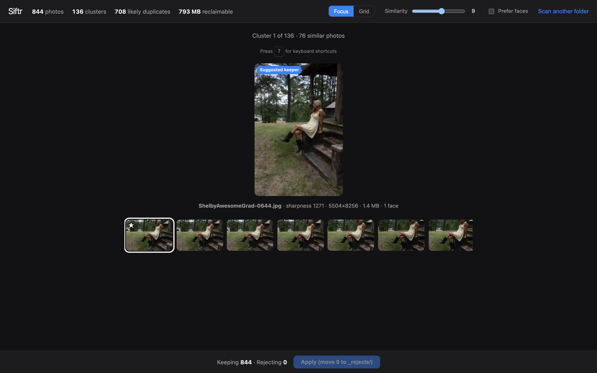
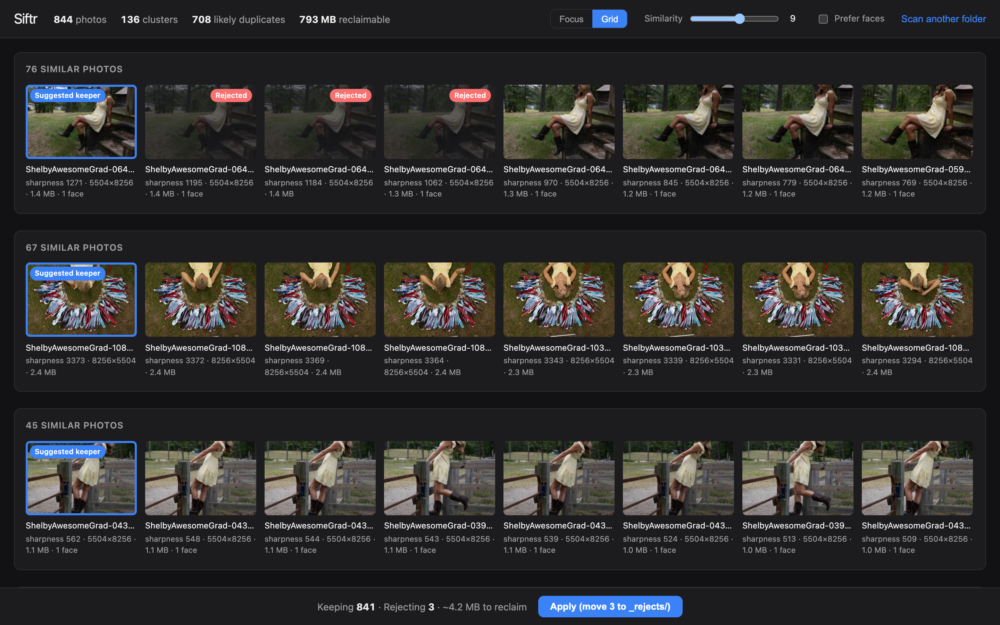

# Siftr

Point Siftr at a folder of photos and it finds near-duplicate clusters (burst
shots, slight edits), scores each shot for sharpness — and optionally for the
sharpest camera-facing face — then gives you a fast keyboard-driven UI to keep
the best and sweep the rest aside. A 1,000-photo shoot becomes a five-minute
review.

> **Non-destructive guarantee:** Siftr never deletes photos. "Apply" moves
> rejected files into a `_rejects/` folder inside the scanned folder, name
> collisions get a numeric suffix instead of an overwrite, and Undo puts
> everything back. There is no code path that deletes an original.



## Quickstart

```bash
# Backend (Python 3.11+)
cd backend
python3 -m venv .venv
.venv/bin/pip install -r requirements.txt
.venv/bin/uvicorn app.main:app --reload --port 8000

# Frontend (in a second terminal, Node 20+)
cd frontend
npm install
npm run dev
```

Open http://localhost:5173, paste a folder path, and hit **Scan**. The Vite
dev server proxies `/api` to the backend. First scans hash and score every
image (roughly 3 minutes per 1,000 photos, capped at 2,000 images per scan);
re-scans hit the cache and return in well under a second.

Supported formats: JPEG, PNG, WebP, HEIC/HEIF. RAW files (NEF/CR3/ARW…) and
videos are ignored.

## The review workflow

**Focus mode** shows one cluster at a time with the suggested keeper starred:

| Key | Action |
|---|---|
| `←` `→` | Move selection within the cluster |
| `Space` | Toggle keep / reject on the selected photo |
| `K` | Keep only the selected photo, reject the rest |
| `Enter` | Accept the suggestion and advance to the next cluster |
| `N` / `P` | Next / previous cluster without deciding anything |
| `U` | Undo the last change |
| `?` | Shortcut overlay |

**Grid mode** shows every cluster at once for a final pass — click any photo
to flip keep/reject. The footer keeps a running tally, and **Apply** moves the
rejects.



## How it works

**Near-duplicate detection — perceptual hashing.** Every image gets a 64-bit
pHash (via [imagehash](https://github.com/JohannesBuchner/imagehash)): a hash
of its low-frequency DCT content, so *visually similar* images get *similar
hashes* — unlike MD5, where one changed pixel changes everything. Two photos
are "similar" when the Hamming distance between their hashes is at most a
threshold (default 9 of 64 bits, adjustable live in the UI).

**Clustering — connected components.** Similar pairs form edges of a graph;
clusters are its connected components, found with union-find. The all-pairs
comparison is O(n²), which is fine for a few thousand photos; a BK-tree over
the hashes is the scaling path beyond that. Clusters are computed at request
time from cached hashes, so changing the threshold re-clusters instantly
without re-scanning.

**Keeper suggestion — Laplacian sharpness.** Each photo's sharpness is the
variance of its Laplacian (edge contrast) computed at a fixed working size so
scores are comparable across resolutions. The sharpest photo in each cluster
is pre-selected as the keeper. The score is only meaningful *relative to the
near-identical shots in the same cluster* — it is not an absolute quality
measure.

**"Prefer faces" mode.** With the toggle on, Siftr detects frontal faces
(OpenCV Haar cascades) and re-ranks keepers: camera-facing shots first, the
sharpest *face region* winning among them, with faceless photos falling back
to overall sharpness. Since the frontal detector only fires on faces turned
toward the camera, it doubles as a looking-at-camera signal.

**Caching.** Per-photo results (hash, sharpness, face metrics, EXIF, 320px
thumbnail) are cached in SQLite keyed by path + mtime + size, stored under
`~/.siftr/` — caching never writes inside scanned folders (only Apply does,
creating `_rejects/`). The schema is versioned; a version bump just triggers
a clean re-scan.

**Safety.** Apply validates every path before moving anything and claims each
destination name atomically (`O_CREAT|O_EXCL`) so nothing can be overwritten
even under races. It runs under a process-wide lock; individual moves are
best-effort (a file that fails to move is left in place and logged), and
every completed move is recorded so Undo can restore it.

## Tests

```bash
cd backend && .venv/bin/pytest
```

28 tests cover the Hamming clustering (boundaries, transitive chains), the
scan cache (hits, pruning, corrupted files), keeper ranking with and without
face preference, and — most importantly — that apply/undo only ever moves
files: checksums are compared before and after, collisions suffix rather than
overwrite, and paths outside the scanned folder abort the whole batch.

## Tradeoffs & what I'd do next

- **Single-user by design.** Review state lives in one in-memory session;
  there are no accounts and no concurrent-reviewer story. That's the right
  scope for a local tool, and the main thing I'd revisit if it ever became a
  hosted service.
- **BK-tree clustering** to replace the O(n²) all-pairs comparison for
  libraries beyond a few thousand photos.
- **Semantic search** ("beach at sunset") via CLIP-style embeddings and a
  vector index — the natural v2 feature.
- **Progress streaming** (SSE) for first scans of huge folders, instead of a
  spinner with a cap.
- **Smarter portrait scoring**: Haar cascades are fast but dated — they miss
  tilted faces and can't detect closed eyes. Facial landmarks would fix both.
- **Frontend test harness** (vitest) for the culling hook and keyboard
  handling; today the meaty logic is covered by backend tests.
